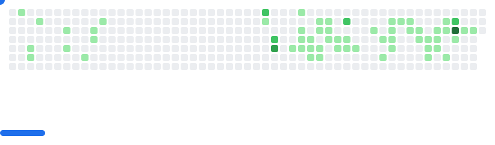

<h1 align="center"><b>Hi , I'm Ethan Backhus </b></h1>

<picture>
  <source
    media="(prefers-color-scheme: dark)"
    srcset="images/breakout-dark.svg"
  />
  <source
    media="(prefers-color-scheme: light)"
    srcset="images/breakout-light.svg"
  />
  
</picture>
<!--  -->

   

###	
##  **About me**

    

###

 

## 🛠️ Skills

| | |
|----------|--------|
| **Frontend** | &nbsp; &nbsp; &nbsp; &nbsp;  |
| **Backend** | &nbsp; &nbsp; &nbsp;  |
| **Database** | &nbsp; &nbsp; &nbsp;  |
| **Version Control & CI/CD** | &nbsp; &nbsp;  |
| **Deployment & Hosting** | &nbsp; &nbsp; &nbsp;  |
| **Development Tools** | &nbsp; &nbsp; &nbsp; &nbsp;  |
| **Design Tools** | &nbsp; &nbsp;  |
| **Operating Systems & Software** | &nbsp; &nbsp; &nbsp; &nbsp; |
| **Browsers** | &nbsp;  |
| **AI Tools** | &nbsp;  |
| | |

 

<!-- ## <b> Skills</b>

  
  
  
  
  
  
  
  
  
  
  
  
  
  
  
  
  
  
  
  
  
  
  
  
  
  
  
  
  
  
  
  
  
  
  
  
  
  
<!--    -->
  <svg height="32" aria-hidden="true" viewBox="0 0 24 24" version="1.1" width="32" data-view-component="true" class="octicon octicon-mark-github v-align-middle color-fg-default">
    <path d="M12.5.75C6.146.75 1 5.896 1 12.25c0 5.089 3.292 9.387 7.863 10.91.575.101.79-.244.79-.546 0-.273-.014-1.178-.014-2.142-2.889.532-3.636-.704-3.866-1.35-.13-.331-.69-1.352-1.18-1.625-.402-.216-.977-.748-.014-.762.906-.014 1.553.834 1.769 1.179 1.035 1.74 2.688 1.25 3.349.948.1-.747.402-1.25.733-1.538-2.559-.287-5.232-1.279-5.232-5.678 0-1.25.445-2.285 1.178-3.09-.115-.288-.517-1.467.115-3.048 0 0 .963-.302 3.163 1.179.92-.259 1.897-.388 2.875-.388.977 0 1.955.13 2.875.388 2.2-1.495 3.162-1.179 3.162-1.179.633 1.581.23 2.76.115 3.048.733.805 1.179 1.825 1.179 3.09 0 4.413-2.688 5.39-5.247 5.678.417.36.776 1.05.776 2.128 0 1.538-.014 2.774-.014 3.162 0 .302.216.662.79.547C20.709 21.637 24 17.324 24 12.25 24 5.896 18.854.75 12.5.75Z"></path>
</svg>

 -->

## <b> Github Stats </b>

  <a href="https://git.io/streak-stats">
    
  <a>

## <b> Let's Connect!</b>

  
  

    

 

  
